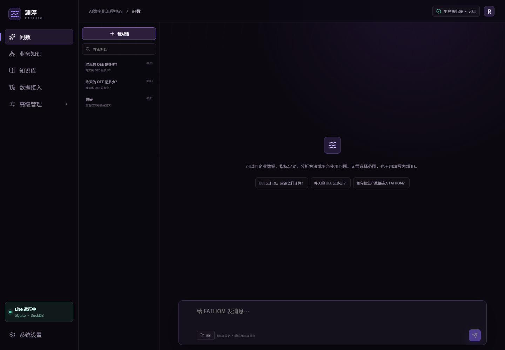
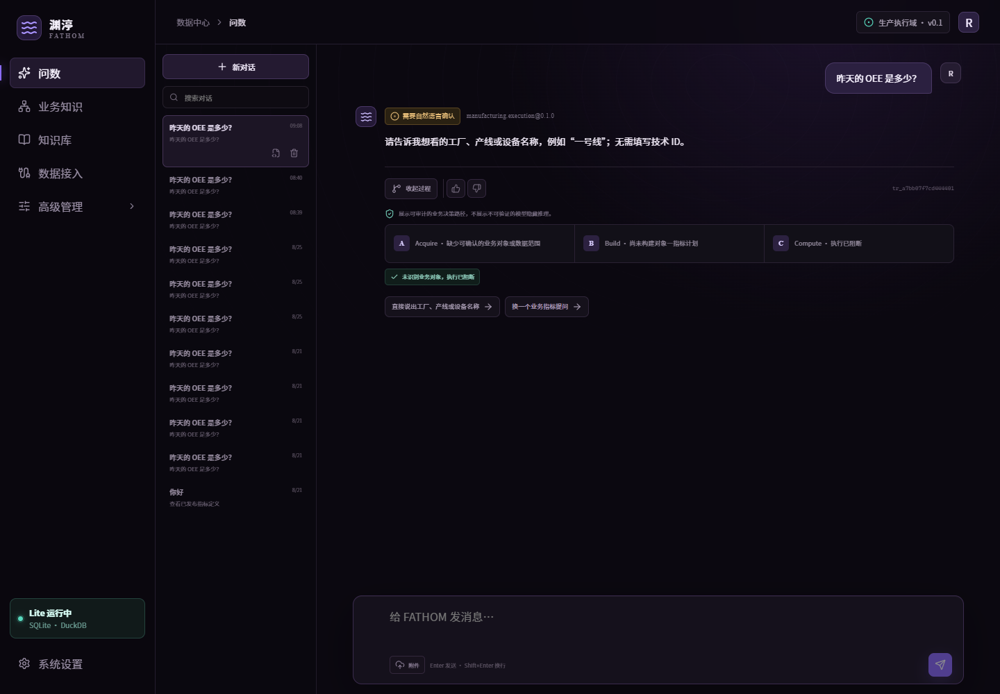
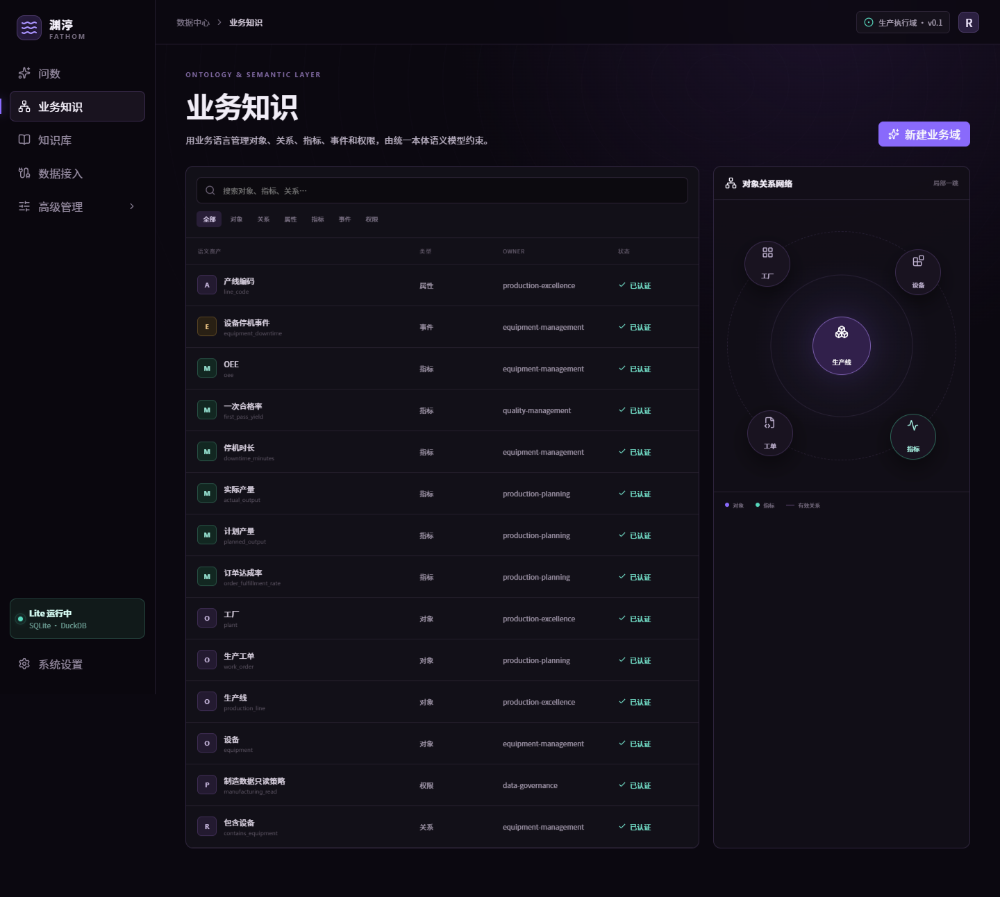
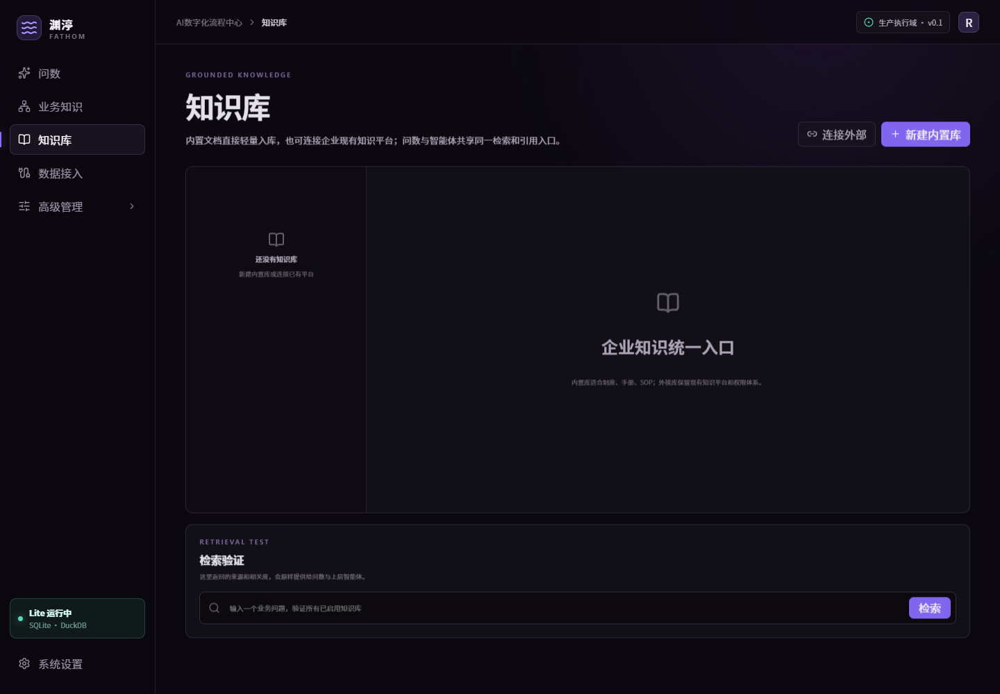
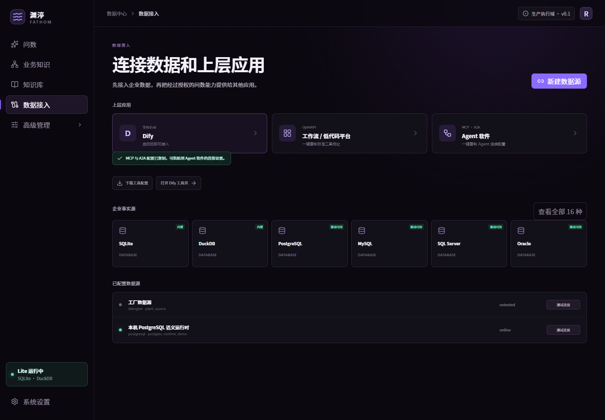
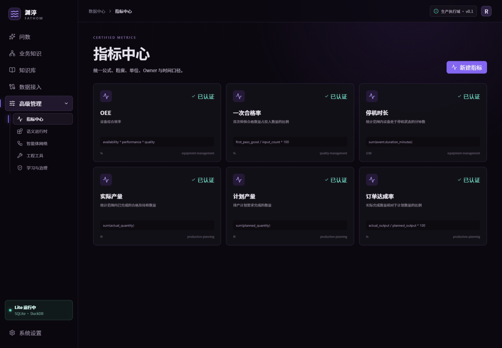
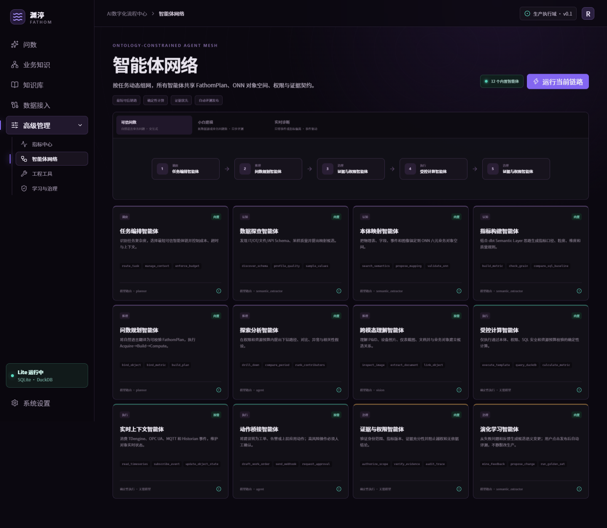
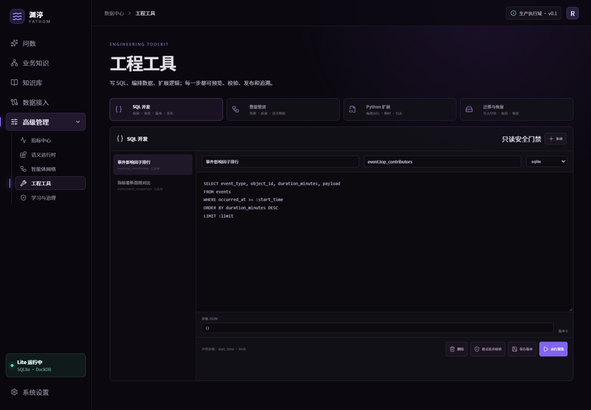
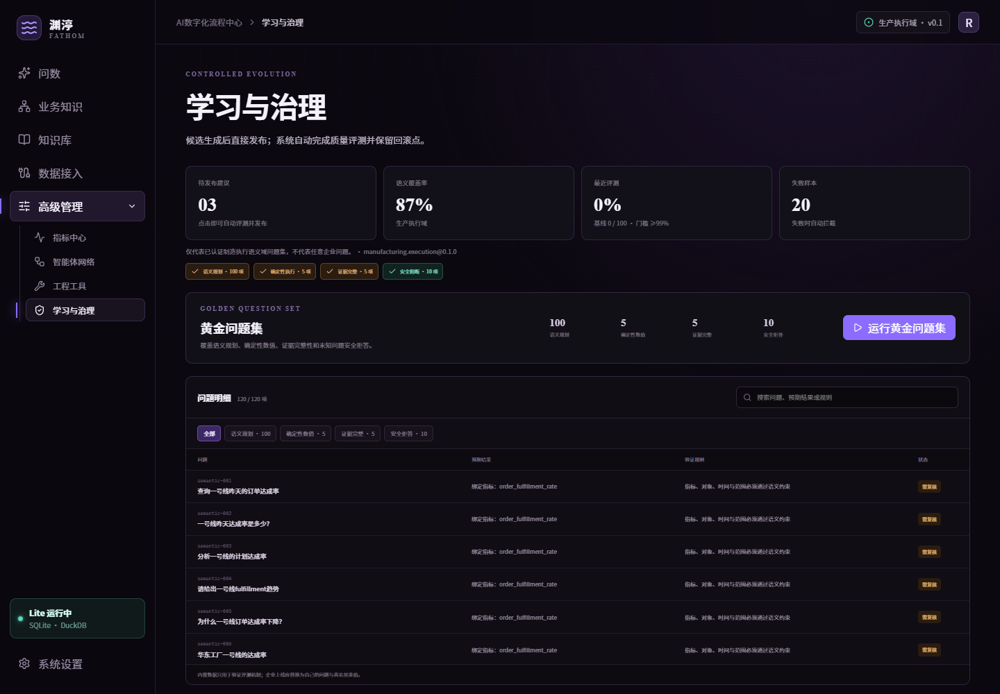
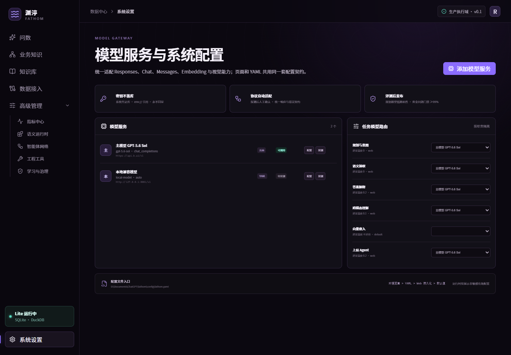

# 渊渟 FATHOM 使用手册

FATHOM 把企业分散的数据、业务定义、对象关系、指标口径、知识和权限组织成一套可计算的语义底座，为问数、分析、智能体和上层应用提供一致、可追踪的业务上下文。

## 1. 第一次使用

不要从“建设全企业本体”开始。选择一个边界清晰、数据可获得、结果可核验的场景，例如生产执行、质量追溯或设备运维，按以下顺序完成第一个闭环：

1. 在“数据接入”中连接一个真实事实源并测试。
2. 在“业务知识”中创建业务域，让系统发现表、字段和关系候选。
3. 在“指标中心”定义 3—10 个高频指标。
4. 在“学习与治理”中运行黄金问题集并发布。
5. 在“问数”中使用真实业务问题验收答案、证据和权限范围。
6. 按需导入制度、SOP 和说明文档，或连接已有知识平台。
7. 最后将受控工具接入上层对话、工作流或智能体平台。

## 2. 问数



用户直接输入自然语言，不需要先选工厂、产线、指标或填写内部对象 ID。系统自动执行：

```text
Acquire：识别对象、时间、权限和可用数据
Build：绑定已发布指标、关系和计算口径
Compute：执行只读确定性计划并组织证据
```

### 2.1 基本交互

- `Enter` 发送，`Shift+Enter` 换行。
- 回答按 SSE 流式呈现，支持 Markdown 标题、列表、表格、引用和代码。
- 每轮最多上传 5 个附件，单个不超过 8 MB。
- 对话附件支持 JPEG、PNG、WebP、PDF、DOCX、TXT、Markdown、CSV、JSON、JSONL 和 YAML。
- 附件只用于本轮理解，不自动写入知识库，也不直接修改语义。
- 左侧会话栏支持新建、搜索、切换、重命名和删除；完整问答会持久化。

### 2.2 结果与证据



回答完成后可展开“思考与执行”，查看可审计的 ABC 业务决策路径、语义绑定和校验结果；可展开“证据”查看来源、语义版本、数据新鲜度和 trace ID。系统展示可核验的执行过程，不展示不可验证的模型隐藏推理。

当对象或指标不能唯一确认时，系统使用业务语言追问；企业事实尚未接入时，明确返回“暂无真实数据”，不会用示例数字冒充真实结果。指标定义、分析方法、平台帮助和一般对话仍可由语义、知识库或已配置模型回答。

## 3. 业务知识



业务知识由六类资产组成：

- 对象：工厂、产线、设备、工单、物料、人员、组织和空间。
- 关系：包含、安装、执行、影响、流转和依赖。
- 属性：编码、类别、状态、位置和业务特征。
- 指标：公式、粒度、单位、维度、Owner 和时间口径。
- 事件：报警、停机、检验、换型、交易和状态变化。
- 权限：角色、组织、对象范围和允许动作。

点击“新建业务域”，选择数据源、业务场景并填写常问问题。系统发现 Schema，生成对象、属性、关系和指标候选，不直接覆盖生产语义。专业用户可通过语义 YAML 和 API 管理完整契约。

推荐命名原则：业务名称优先、技术字段作为映射；对象和指标必须有稳定唯一键；别名用于吸收现场术语差异；指标必须明确单位、粒度、Owner 和时间边界。

## 4. 知识库



知识库与本体、语义层分工不同：知识库保存文档事实和说明，本体定义业务对象与关系，指标层定义可计算口径。

- 内置知识库：复用 SQLite，支持 TXT、Markdown、CSV、JSON、JSONL 和 YAML；单文件不超过 5 MB，自动切分、去重并保留来源。
- 外接知识库：通过 HTTP GET/POST 检索已有知识平台，数据不搬迁；密钥使用 `env://变量名`。

在页面底部使用“检索验证”检查原文、相关度和来源。问数无法形成指标计算时可以调用知识检索，但企业数值仍优先使用已发布指标和真实事实源。

## 5. 数据接入



点击新增连接，填写非敏感配置和 `secret_reference`，保存后执行“测试”和“发现结构”。页面会显示连接器是否内置、驱动是否可用及安装提示。

内置：SQLite、DuckDB、CSV/JSON/Parquet、REST。

按需驱动：PostgreSQL、MySQL、SQL Server、Oracle、TDengine、MQTT、OPC UA、Redis、Elasticsearch、Neo4j、Qdrant。工业历史库使用厂商插件。

配置示例：

```json
// 本地文件
{"path":"D:/data/production.parquet"}

// 关系数据库
{"host":"10.0.0.20","port":5432,"database":"factory","username":"fathom_ro","schema":"public"}

// TDengine
{"endpoint":"ws://10.0.0.30:6041","database":"manufacturing","username":"fathom_ro"}

// OPC UA
{"endpoint":"opc.tcp://10.0.0.50:4840","username":"fathom","browse_limit":100}
```

密码和令牌不能写入配置 JSON，使用 `env://FATHOM_SOURCE_PASSWORD`。生产账号必须只读并限制可访问范围。

## 6. 指标中心



指标至少需要：唯一标识、名称、业务定义、确定性表达式、单位、维度、粒度、Owner、数据映射和别名。保存后形成候选；发布时自动运行结构校验和黄金问题集，通过后生成新语义版本，失败则保留候选。

不要把自然语言提示词当成指标公式。模型可以帮助生成候选，但数值计算必须落到已验证表达式、SQL/DSL 或受控工具。

## 7. 智能体网络



智能体按任务组成最短可信链路，负责数据探查、本体映射、指标构建、问题规划、探索分析、跨模态理解、受控计算、证据权限和演化治理。

内置链路：

- 可信问数：规划、语义校验、确定性计算和证据输出。
- 引导建设：发现 Schema 并生成对象、属性和关系候选。
- 自适应诊断：读取指标与事件，分析影响因素，生成可审核的动作草案。

每一步保留状态、摘要、耗时和 trace。涉及外部写入或生产动作时，不由模型绕过权限直接执行。

## 8. 工程工具



### 8.1 SQL 模板

用户可以新建、编辑、校验、预览、保存、查看版本和恢复。只允许单条只读 SELECT/CTE，支持命名参数；写操作、DDL 和多语句被拒绝。

### 8.2 数据管道

支持重命名、类型转换、过滤、派生、去重、质量检查和 ONN 映射。预览使用 DuckDB，并限制内存、线程和返回行数。生产全量/增量任务应由企业调度体系执行。

### 8.3 Python 扩展

用户可以编辑函数代码、输入 JSON、校验、沙箱运行、查看运行记录和发布版本。扩展有超时和内存限制，不用于绕过 SQL 只读、安全和审批规则。

### 8.4 导入、导出与备份

- 导入预检：CSV、JSON、JSONL、Parquet 和语义 YAML。
- 导出：语义资产包、对象 CSV、指标观测 CSV 和事件 CSV。
- 备份：SQLite 一致性快照、语义文件和 manifest。
- 恢复：二次确认，并先创建保护性备份。

## 9. 学习与治理



系统从 Schema、语义模型、失败查询、用户纠正和新术语中生成候选，不静默修改生产语义。发布链路为：

```text
候选 → 冲突检查 → 黄金问题集 → 直接发布新版本 → 留痕与回滚
```

### 9.1 黄金问题集

内置制造执行基线位于 `apps/api/src/fathom/application/evaluation.py`，当前包含：

- 5 个指标 × 20 种表达，共 100 条语义规划问题。
- 5 条确定性数值基线。
- 5 条证据完整性校验。
- 10 条未知指标安全拒答。

入口为“学习与治理 → 黄金问题集”。页面可按类别筛选或搜索具体问题，并显示预期结果、验证规则和最近评测状态；点击“运行黄金问题集”后，结果会持久化并显示通过率、门禁和语义版本。内置基线只用于验证软件机制，不能代表任意企业准确率。企业上线必须建立自己的黄金问题集，至少包含：问题、期望对象、指标、时间与范围、基准值和容差、权限结果、是否应拒答。所谓 99% 仅指指定业务域、指定黄金问题集、指定语义和模型版本下的评测结果。

## 10. 系统设置



管理员可以配置模型 URL、API Key、模型 ID、协议模式、模型参数和角色路由。系统自动发现模型并探测生成能力。模型目录可访问但生成失败时，会标记为不可调用。

页面配置适合交互管理；生产服务器也可以通过 `config/fathom.yaml` 和 `FATHOM_*` 环境变量维护。密钥不进入普通配置、数据库备份或部署包。

## 11. 接入上层平台

“数据接入”页面提供三种通用入口：Dify OpenAPI 工具、其他工作流平台的 OpenAPI 地址，以及 Agent 软件的 MCP/A2A 配置。上层平台负责编排、会话和应用发布；FATHOM 负责业务对象、指标、权限、受控计算、证据和 trace。

完整操作见 [部署与接入指南](部署与接入指南.md)。

## 12. 权限与审计

Lite 本机模式默认关闭认证。生产环境应启用 Bearer Token，按最小权限分配 viewer、operator、semantic_owner 和 admin，并配置对象范围。问数、OpenAPI、MCP、A2A 和智能体共用同一授权范围。

变更操作记录 principal、角色、路径、状态、耗时和客户端地址，不记录请求正文与密钥。对外排障应使用 trace ID，不应复制数据库密码或模型 API Key。

## 13. 日常验收清单

1. 数据源连接、Schema 发现和只读权限正常。
2. 指标定义与财务/生产口径负责人确认一致。
3. 真实数值与基准系统在容差内一致。
4. 未知指标、越权对象和空数据能够安全拒答。
5. 回答包含语义版本、证据、数据新鲜度和 trace。
6. 模型或语义变更后，黄金问题集重新通过。
7. 备份可下载，恢复演练成功。
8. 上层平台仅使用 FATHOM 受控工具，不持有事实源凭证。
