# 渊渟 FATHOM 技术架构与核心流程

两张图均对应当前产品实现。`docs/diagrams` 中保留 Mermaid 源文件，便于后续随代码演进维护；SVG 可直接用于方案、培训和部署文档。

## 技术架构

架构的核心不是把模型直接连到数据库，而是把所有入口统一收敛到可信语义控制面：ONN 描述业务世界，ABC 把自然语言编译成可校验计划，受控智能体网络负责协作，确定性引擎负责计算，证据和权限贯穿全过程。

## 问数与自进化流程

用户不需要先选择工厂、产线或内部对象 ID。系统自动识别范围；无法唯一确认时才用业务语言澄清。企业事实缺失时不生成假数，但定义、方法和通用问题仍可由语义、知识库与大模型自然回答。运行反馈只生成候选，必须经过黄金问题集和冲突检查后才发布为新语义版本。

## 可编辑源文件

- `docs/diagrams/fathom-architecture.mmd`
- `docs/diagrams/fathom-query-evolution-flow.mmd`
