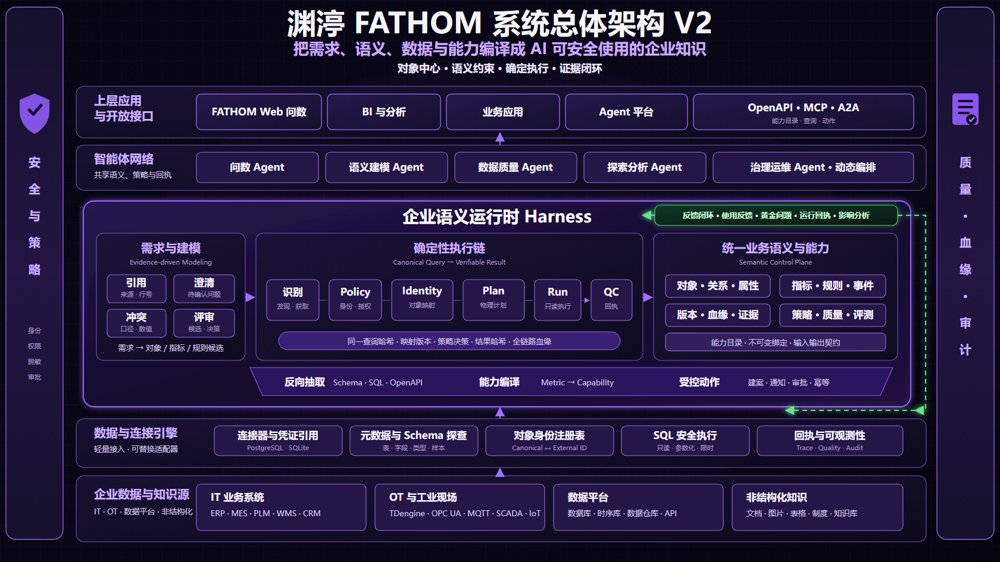
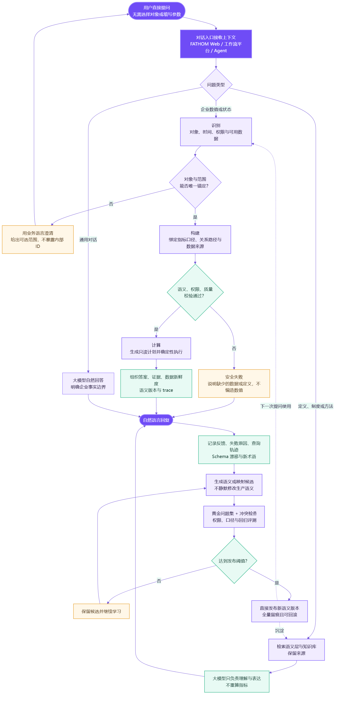

# 渊渟 FATHOM 架构设计

> 版本：0.4 · 适用范围：FATHOM 企业语义运行时 · 更新日期：2026-08-25

## 1. 定位与核心判断

FATHOM 把企业分散的数据、业务知识和运行事件编译成可验证、可计算、可治理的对象网络，为问数、分析、智能体和上层应用提供同一套可信事实、语义与执行边界。

企业 AI 的主要障碍通常不是模型能力，而是缺少模型可以稳定依赖的业务世界：对象是谁、关系何时有效、指标怎样计算、数据由谁查看、结论来自哪里、动作能否执行。FATHOM 的职责是构建这层企业级上下文和控制面，而不是再造数据仓库，也不是让大模型直接操作数据库。

架构遵循五条原则：

1. **模型识别语义，程序执行规则**：LLM 负责识别意图、对象、指标和解释结果，不生成可直接执行的任意 SQL。
2. **验证失败就不执行**：未知、歧义、越权、口径未发布和无数据必须成为明确状态，不能用猜测补齐。
3. **自动发现，人工发布**：数据源和知识文档可以自动提炼候选，但生产语义必须经过 Owner、评测和治理门禁。
4. **证据先于结论**：数值答案、诊断结论和外部动作都必须绑定 trace、语义版本、数据时间和证据。
5. **允许组织差异显式存在**：不同基地、部门的口径通过 domain、version、owner 并存；只有跨域问题才建立映射，不强制一次性统一企业全部定义。

## 2. 总体架构



系统从上到下分为六层：

1. **入口与应用层**：FATHOM Web、BI、运营应用、工作流、Chatflow 和 Agent，通过 OpenAPI、MCP 或 A2A 使用能力。
2. **协议与安全网关**：REST/OpenAPI、SSE、MCP、A2A，以及身份、角色、对象范围和审计。
3. **Harness 与应用服务层**：会话生命周期、Agent 编排、需求证据、MQL 计划、能力编译、受控动作、反馈归因、RCA、治理和评测。
4. **本体与语义控制层**：对象、关系、属性、指标、事件、权限、跨系统对象身份、别名、公式、维度、Owner 和版本。
5. **确定性执行与证据层**：策略决策、对象映射、物理计划、固定查询模板、质量校验、结果验证和运行回执。
6. **连接与存储层**：IT/OT/文件/API 连接器、Schema/SQL/OpenAPI 反向抽取、SQLite/PostgreSQL 控制面、DuckDB 轻量分析，以及可替换的图、向量和企业数据库适配器。

企业大数据默认留在原系统。FATHOM 只持有完成语义控制、计划、证据、会话、反馈和治理所需的最小状态；大规模计算下推到原数据库、时序引擎或企业计算平台。

### 2.1 语义运行时技术视图



新版把职责收敛为三个平面：控制平面管理需求证据、语义、映射、质量、能力和发布门禁；运行平面执行 `MQL → 策略 → 逻辑计划 → 多源路由 → 物理计划 → 连接器 → 质量 → 收据`；数据平面保留企业事实源和最小 FATHOM 状态。LLM 只参与受约束的意图识别、解释和建议，不生成可直接执行的任意 SQL。

## 3. 对象网络与语义资产

对象网络用业务对象描述企业，而不是把数据库表名直接暴露给模型。核心元素包括：

- **对象**：工厂、产线、设备、工单、物料、人员、组织、空间。
- **关系**：包含、安装、执行、影响、流转、依赖，并带有效时间和来源。
- **属性**：对象的稳定标识、状态和业务特征。
- **指标**：定义、公式、单位、粒度、维度、Owner、数据映射和版本。
- **事件**：告警、停机、检验、换型和状态变化。
- **权限/策略**：角色、组织、对象范围和允许动作。

表、字段、API、Topic 和节点只是对象网络的物理映射。上层应用依赖稳定业务语义，底层系统变化只更新映射。

### 3.1 本体落地策略

本体不以“让模型理解企业一切”为第一阶段目标，而采用业务域渐进建设：

```text
业务问题集 → 最小对象集 → 核心指标与事件 → 数据映射 → 黄金问题 → 发布版本
```

首个业务域建议限制在一个工厂、5–10 个指标和 30–50 个可验收问题。跨基地定义不一致时，保留各自资产和 Owner，再建立对照指标或映射关系。这样既能支撑问数，也避免把组织权责冲突错误地当成纯技术问题。

## 4. 数据接入与一次性语义提炼

原始 Schema 发现只解决“有哪些表和字段”。完整接入闭环还要回答“哪些是业务对象、指标、事件和关系”。接入流程为：

```text
连接测试 → Schema 发现 → 规范化与哈希 → 快照差异
        → 规则/模型提炼 → 冲突检查 → 治理候选 → 人工评审
```

### 4.1 数据源提炼

- 首次接入保存 `SchemaSnapshotRecord`，记录完整 Schema 和校验和。
- 再次执行时与上一快照比较；未变化返回 `unchanged`，不重复生成候选。
- 变化时记录新增、删除和类型变化，并生成对象、属性、外键关系、指标和事件候选。
- 指标聚合属于高风险推断，必须标记 `requires_business_review`。
- 提炼运行保存为 `ExtractionRunRecord`，包括输入哈希、状态、差异和治理结果。

### 4.2 知识文档提炼

知识文档先按内容哈希去重并切块索引。检测到指标、口径、公式、数据字典等明确证据时，才提炼指标、别名和公式候选；普通制度和说明文档只进入检索，不生成语义资产。

所有自动提炼结果只调用治理服务创建 `candidate`，不会直接写入已发布语义。

### 4.3 需求证据与评审

需求不是一段脱离来源的描述，而是可追踪的建模输入。每条需求保存来源 URI、原文摘录和行号，系统从陈述中匹配对象、指标和规则，并自动生成待澄清问题。与已有需求出现重叠资产或潜在数值冲突时，冲突会随候选一起进入评审，而不是在发布后才暴露。

需求状态使用 `candidate → in_review → approved/rejected`，评审记录包含 reviewer、comment 和时间。获批需求与对应语义资产建立血缘，后续影响分析可以回答“这个口径来自哪条需求、修改它会影响哪些能力和查询”。

### 4.4 跨系统对象身份与反向抽取

FATHOM 使用稳定的 `canonical_object_id` 表达业务对象，并为每个数据源登记 `source_key + external_object_id`。运行时在编译物理计划前完成身份解析，因此上层始终使用 `line_01` 这类统一对象，MES、ERP 或 PostgreSQL 中的局部编码由对象身份注册表吸收。

已有资产通过反向抽取进入建模入口：Schema 提供结构候选，SQL 提供表、字段和指标映射候选，OpenAPI 提供查询与动作能力候选。反向结果保持候选和证据属性，必须经过 Owner 复核后才能成为发布映射或能力。

## 5. 可信问数：从自然语言到 MQL

FATHOM 把自然语言问题拆成「识别 → 构建 → 计算」三阶段：先识别指标、对象与时间范围，再构建受约束的执行计划，最后由确定性口径计算并附上证据。

- **识别**：识别用户意图、业务对象、指标、时间、权限和可用数据，消解别名与范围。
- **构建**：在已发布语义空间内构造 MQL，绑定指标、对象、维度、过滤和比较方式。
- **计算**：通过校验后调用固定查询模板，执行确定性计算并组织证据。

### 5.1 MQL 中间表示

MQL 是结构化数据，不是 SQL 文本。核心字段包括：

```text
metric + object_ids + dimensions + filters + time_range
       + comparison + limit + semantic_version
```

执行前必须通过：

1. 指标存在且属于已发布语义资产；
2. 维度和过滤字段属于该指标口径；
3. 业务对象存在、有效且在用户授权范围内；
4. 操作符属于封闭白名单；
5. 时间范围可解析且请求窗口内确有数据。

校验成功后，由 `MqlEngine` 选择固定 ORM/SQL 模板并传入参数。系统不接受模型生成的 SQL，也不允许通过 Prompt 扩大权限。

### 5.2 准确率边界

问数产品的可信目标不是“任何问题都强行回答”，而是：

- 可唯一验证的问题返回 `verified`；
- 已验证但没有事实数据返回 `verified_no_data`；
- 对象或指标歧义返回 `needs_clarification`；
- 越权、未发布口径和非法维度在执行前阻断。

因此“100%”应理解为：在已发布业务域和验收集内，所有执行结果都经过确定性验证；无法验证时不输出伪造数值。

### 5.3 确定性运行时与执行回执

语义查询进入统一执行链：

```text
FATHOM MQL → 策略决策 → 对象身份解析 → 逻辑计划
           → 数据源路由 → 物理计划 → 参数化只读执行
           → 质量契约 → 运行回执
```

运行回执保存逻辑查询哈希、映射版本、对象身份映射、策略结果、物理计划摘要、数据源尝试、质量结果和结果哈希。它既是排障依据，也是黄金问题重放、血缘追踪和发布门禁的统一证据。

## 6. 会话反馈与质量闭环



每次查询形成 trace，记录计划、MQL、语义版本、数据新鲜度、证据和失败原因。反馈层同时接收三类信号：

- **自有界面显式反馈**：每条回答的 👍/👎。
- **外部平台显式反馈**：先绑定外部 message，再导入 rating 和文字。
- **保守隐式反馈**：仅识别“不是、错了、不对、我要的是、答非所问”等明确纠正表达。

`FeedbackRecord` 保存 conversation、turn、trace、来源、评分、类别、情绪、置信度、语义版本、MQL 和结果哈希。常见类别包括指标错误、时间错误、范围错误、数值错误、数据陈旧、解释不足和延迟。

反馈不会直接修改生产语义。它用于：

1. 形成回归样本和失败问题集；
2. 定位口径、映射、数据质量或交互问题；
3. 识别高频成功问题，建立缓存或快速路由；
4. 生成新的语义候选并再次经过治理门禁。

快速通道只降低响应耗时，不绕过 MQL、权限和版本校验。

## 7. 根因分析与结论分级

RCA 不是让模型根据相关事件自由编故事，而是执行可持久化的证据阶梯：

1. **confirm_anomaly**：确认当前值、对比值、时间窗和变化幅度。
2. **decompose_metric**：读取已发布公式，识别可分析因子。
3. **rank_contributors**：按对象、时间窗、持续时间和影响量排序事件。
4. **validate_hypothesis**：校验对象与时间一致性，记录反证和证据缺口。

`AnalysisRunRecord` 保存分析步骤、结果、证据和 trace。结论严格分为：

| 等级 | 含义 | 对外措辞 |
| --- | --- | --- |
| `driver` | 只确认变化或贡献因素 | 驱动因素/相关因素 |
| `suspected_cause` | 多项证据支持关联，尚未证明因果 | 疑似原因 |
| `verified_root_cause` | 具有明确因果核验标记和完整事件证据 | 已验证根因 |

没有达到因果条件时，系统必须保留“关联不等于因果”的反证说明。

## 8. Harness 与智能体网络

Harness 是围绕模型的运行系统，不是单个 Prompt。FATHOM Harness 负责：

- 会话生命周期和持久化；
- FathomPlan/MQL 协议与状态转换；
- 模型路由、工具注册和上下文组织；
- 需求证据、对象身份、映射版本和能力目录；
- 权限、审批、超时和资源预算；
- 流式进度、步骤回执、trace 和可恢复记录；
- 黄金问题、反馈回归和发布验收。

智能体按控制、认知、推理、执行和治理分层，共享同一本体空间和权限。典型链路：

- **可信问数**：问题规划 → MQL 校验 → 确定性计算 → 证据输出。
- **引导建设**：Schema 快照 → 语义提炼 → 冲突检查 → 治理候选。
- **自适应诊断**：异常确认 → 指标拆解 → 事件贡献 → 假设验证 → 动作草案。

外部写入、生产控制和高风险动作必须经过独立授权；模型不能仅凭对话获得执行权限。

## 9. 数据、图、向量与知识

### 9.1 控制面存储

SQLite 保存配置、对象实例、关系、语义资产、观测值、事件、会话、知识文档、反馈、分析运行、评测和治理结果。它适合单机、边缘和中小规模部署，零服务依赖，备份和迁移简单。

多实例并发写、高可用和集中数据库运维场景可切换企业数据库；应用层通过 SQLAlchemy 适配，语义和 API 契约不变。

### 9.2 分析执行

DuckDB 用于文件扫描、管道预览和本地分析，并配置内存、线程和行数上限。在线问数通过 MQL 固定模板读取受控事实；大规模聚合下推到源系统。

### 9.3 图与向量

默认用关系表表达对象图，满足一跳上下文、关系路径和权限范围，不强制部署独立图数据库。复杂图遍历可接外部图引擎。

sqlite-vec 作为可选嵌入扩展，默认关闭。轻量知识检索首先使用 SQLite 文档块和确定性文本匹配；向量规模增长后可接外部向量服务。

### 9.4 知识库

内置知识库保存小型文档与来源；外接适配器调用已有知识平台，避免数据搬迁。知识库回答文档事实，本体和指标层负责业务结构与可计算事实，二者在统一查询服务中编排。

## 10. 接口与上层 AI

FATHOM 提供 OpenAPI、SSE、MCP 和 A2A。所有入口最终进入同一查询、权限、语义、知识、反馈和证据服务，避免不同上层应用产生不同指标口径。

主要接口族：

- `/query/*`：计划、问数、流式响应、会话和附件。
- `/data-sources/*`：连接测试、Schema 发现和一次性语义提炼。
- `/knowledge-bases/*`：知识库、文档导入和检索。
- `/semantics/*`、`/governance/*`：语义资产、候选、评审、发布和回滚。
- `/feedback`、`/integrations/external/*`：自有反馈、外部平台消息绑定和反馈导入。
- `/analysis-runs/*`：RCA 步骤、证据和结论回执。
- `/agent-mesh/*`：受控智能体链路和运行记录。
- `/runtime/requirements/*`：需求探索、引用、冲突和评审。
- `/runtime/object-identities`、`/runtime/reverse-assets`：跨系统对象身份和存量 SQL/OpenAPI 反向抽取。
- `/runtime/query`、`/runtime/receipts`：确定性多源执行和证据回执。
- `/runtime/capabilities/*`、`/runtime/actions`：指标能力编译、发布、调用与动作留痕。

上层 AI 获得的是稳定工具，而不是裸表、数据库凭证或任意 SQL 权限。

指标发布后可以编译为 `semantic.metric.<metric_key>` 能力。编译器把指标键固化为不可覆盖绑定，只暴露对象、时间、维度等受控参数；发布后的能力自动进入 OpenAPI/MCP 能力目录。具有副作用的建案和通知能力统一经过角色、审批令牌和幂等键校验，动作结果单独留痕。

## 11. 治理、版本与发布门禁

Schema 漂移、新术语、知识口径、失败查询和用户纠正都可以生成 `SemanticChangeRecord`。候选发布前依次执行：

```text
candidate → in_review → approved → published
                          ↓
                       rejected
published → rolled_back
```

治理检查包括：

- 已发布资产冲突和未完成候选去重；
- Owner、domain、版本和来源完整性；
- 指标公式、单位、维度、粒度和数据映射；
- 黄金问题的语义规划、确定性数值、证据完整和安全拒答；
- 发布前后回归差异及可回滚快照。

这就是“自进化”的边界：自动发现和提案，受控验证和发布，而不是模型静默改写规则。

## 12. 安全与可信控制

- 连接器默认只读，执行器只使用固定模板或已发布 SQL 模板。
- Bearer Token 使用摘要保存，按角色和对象范围授权。
- 模型和数据源密钥使用环境变量或系统凭证库引用。
- 回答携带语义版本、MQL、数据新鲜度、证据和 trace ID。
- 空数据不生成示例值，未知口径和非法维度不进入计算。
- 自动提炼、反馈和 RCA 不能绕过治理发布或动作审批。
- 所有非 GET 操作写入审计事件，生产语义可回滚。

## 13. 运行与部署拓扑

默认轻量部署由一套 FastAPI 服务、编译后的 Vue 静态页面和一个 SQLite 数据库组成。前后端同源部署，避免额外 Web 网关依赖。上层工作流平台和 Agent 可通过 OpenAPI 或 MCP 调用 FATHOM。

扩展部署保持接口不变，可替换：

- SQLite → 企业关系数据库；
- 本地文件/DuckDB → 湖仓或分布式计算引擎；
- 关系表对象图 → 图数据库；
- 文本匹配/sqlite-vec → 企业向量服务；
- 单机进程 → 多实例服务和集中观测平台。

运行数据库、密钥、缓存、模型和外部平台数据卷不进入发布包。

## 14. 可观察性与验收

可观察性围绕四类运行记录：

- `QueryTraceRecord`：问题、计划和结果状态；
- `ExtractionRunRecord`：接入提炼输入、差异和治理输出；
- `AnalysisRunRecord`：RCA 步骤、证据、反证和结论等级；
- `AgentRunRecord` / `AuditEventRecord`：智能体回执和操作审计。

上线门禁至少满足：

1. 指定业务域黄金问题全部通过；
2. 未知、歧义和越权问题全部正确澄清或阻断；
3. 每个数值答案都带发布口径、数据来源、时间和 trace；
4. 每个根因结论都带 analysis run、证据等级和反证；
5. 后端测试、类型检查、前端构建和工具契约检查通过。

## 15. 技术实现映射

| 层 | 当前技术与实现 |
| --- | --- |
| 后端 | Python 3.12、FastAPI、Pydantic、SQLAlchemy、sqlglot |
| 前端 | Vue 3、TypeScript、Vite |
| 语义计划 | FathomPlan、MQL、需求证据、对象身份、映射与能力契约 |
| 控制面存储 | SQLite 或 PostgreSQL；SQLAlchemy 统一适配 |
| 分析执行 | 固定 ORM/SQL 模板、DuckDB |
| 可选向量 | sqlite-vec，默认关闭 |
| 连接器 | 关系数据库、文件、REST、TDengine、MQTT、OPC UA、Redis、全文、图、向量 |
| 协议 | REST/OpenAPI、SSE、MCP、A2A |
| 治理 | 引用、澄清、冲突、候选、Owner、版本、黄金问题、评审、发布、回滚 |
| 安全 | Token 摘要、角色、对象范围、MQL 门禁、审计、密钥引用 |
| 工程质量 | pytest、ruff、vue-tsc、Vitest、Vite 构建、契约与视觉回归 |

## 16. 设计边界与扩展原则

FATHOM 不取代企业现有数据库、数据仓库、调度器、主数据系统和上层应用。它解决的是这些系统之间最难复用的一层：统一业务对象、指标口径、权限、证据和 AI 可调用的受控工具。

扩展遵循以下原则：

- 将更多连接器的 Schema 漂移接入快照和候选流程；
- 扩展 MQL 聚合、维度下钻和确定性编译模板；
- 把反馈类别自动加入黄金问题与缺陷看板；
- 为 RCA 增加公式因子观测、对照组和因果核验工作流；
- 完善多语义域映射、发布影响分析和多实例存储适配。

轻量化不是删除核心能力，而是默认只部署一套 Web 服务和一个本地数据库；图、向量、外部知识和高并发存储按实际规模替换适配器，上层接口和使用方式保持稳定。
