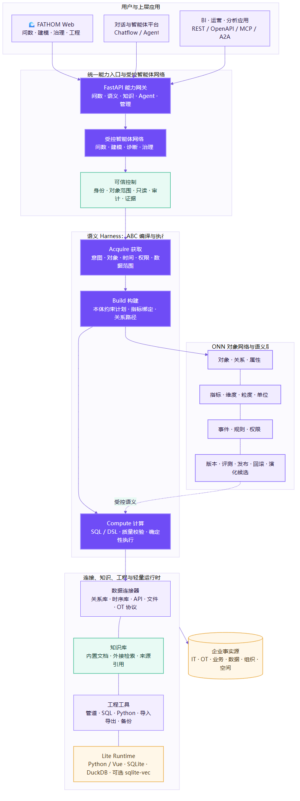

# 渊渟 FATHOM 架构设计

## 1. 定位

FATHOM 把企业分散的数据、业务知识和运行事件编译成可验证、可计算、可治理的对象网络，为问数、分析、智能体和上层应用提供同一套可信事实、语义与执行边界。

工业 AI 的主要障碍通常不是模型能力，而是缺少模型可以稳定依赖的业务世界：对象是谁、关系何时有效、指标怎样计算、数据由谁查看、结论来自哪里、动作能否执行。FATHOM 的职责就是构建这层企业级上下文和控制面。

## 2. 总体架构



架构从上到下分为五层：

1. **入口与应用层**：FATHOM Web、BI、运营应用、工作流、Chatflow 和 Agent，通过 OpenAPI、MCP 或 A2A 使用能力。
2. **统一能力网关与智能体网络**：提供问数、语义、知识、Agent、治理和权限入口；按任务组织最短受控链路。
3. **语义 Harness 与 ABC 编译器**：把自然语言转换为可校验的 Acquire、Build、Compute 计划。
4. **ONN 对象网络与语义层**：管理对象、关系、属性、指标、事件、权限、版本、评测、发布和回滚。
5. **连接与轻量运行时**：连接 IT、OT、业务和文件数据；使用 SQLite、DuckDB 和按需 sqlite-vec 保存控制面状态与执行轻量分析。

企业大数据默认留在原系统。FATHOM 不复制整个数据平台，只持有完成语义控制、计划、证据、会话和治理所需的最小状态。

## 3. ONN：对象网络而不是表目录

ONN 用业务对象描述企业，而不是把数据库表名直接暴露给模型。核心元素是：

- 对象：工厂、产线、设备、工单、物料、人员、组织、空间。
- 关系：包含、安装、执行、影响、流转、依赖，并带有效时间和来源。
- 属性：对象的稳定标识、状态和业务特征。
- 指标：定义、公式、单位、粒度、维度、Owner、数据映射和版本。
- 事件：告警、停机、检验、换型和状态变化。
- 权限：角色、组织、对象范围和允许动作。

表、字段、API、Topic 和节点只是对象网络的物理映射。上层应用依赖稳定业务语义，底层系统变化只需更新映射。

## 4. ABC：把问数变成受控编译

```text
Acquire → Build → Compute
```

- **Acquire**：识别用户意图、业务对象、指标、时间、权限和可用数据，消解别名与范围。
- **Build**：在已发布语义空间内绑定对象、关系、指标口径和数据映射，进行类型、权限和质量校验。
- **Compute**：生成只读 SQL/DSL 或受控工具调用，执行确定性计算，组织证据并生成自然语言回答。

模型是翻译器与解释器，不是指标规则和企业事实的创造者。无法唯一锚定时使用业务语言澄清；越权、未知口径或缺少事实时在计算前阻断。

## 5. 问数与自进化流程


每次查询形成 trace，记录计划、绑定、数据新鲜度、证据和失败原因。Schema 漂移、新术语、失败查询和用户纠正被转化为语义候选，不直接修改生产语义。

候选发布前执行冲突检查和黄金问题集：语义规划、确定性数值、证据完整性、权限和安全拒答全部达到阈值后，才生成新语义版本。所有发布可追踪、可比较、可回滚。这是“自进化”的含义：自动发现与提案，受控验证与发布，而不是模型静默改写规则。

## 6. 数据、图、向量与知识

### 6.1 控制面存储

SQLite 保存配置、对象映射、语义版本、会话、知识文档、运行记录和治理结果。它适合单机、边缘和中小规模部署，零服务依赖，备份和迁移简单。

多实例并发写、高可用和集中数据库运维场景可切换企业数据库；应用层通过 SQLAlchemy 适配，语义和 API 契约不变。

### 6.2 分析执行

DuckDB 用于文件扫描、管道预览和本地分析，配置内存、线程和行数上限。大规模计算下推到原数据库、时序引擎或企业计算平台。

### 6.3 图与向量

默认用关系表表达对象图，满足一跳上下文、关系路径和权限范围，不强制部署独立图数据库。复杂图遍历可接外部图引擎。

sqlite-vec 作为可选嵌入扩展，默认关闭。轻量知识检索首先使用 SQLite 文档块和确定性文本匹配；向量规模增长后可接外部向量服务。

### 6.4 知识库

内置知识库保存小型文档与来源；外接适配器调用已有知识平台，避免数据搬迁。知识库回答文档事实，本体和指标层负责业务结构与可计算事实，二者在统一查询服务中编排。

## 7. 智能体网络

智能体按职责分层：控制、认知、推理、执行和治理。它们共享同一 ONN、权限和 trace，而不是各自维护一套提示词和数据连接。

典型链路：

- 可信问数：问题规划 → 语义校验 → 受控计算 → 证据输出。
- 引导建设：Schema 发现 → 本体映射 → 指标候选 → 黄金问题验证。
- 自适应诊断：指标读取 → 事件关联 → 影响分析 → 动作草案。

智能体调用只产生受控计划和工具调用；外部写入、生产控制和高风险动作必须经过独立授权。

## 8. 接口与上层 AI

FATHOM 提供 OpenAPI、MCP 和 A2A。所有入口最终进入同一查询、权限、语义、知识和证据服务，避免不同上层应用产生不同指标口径。

上层 AI 获得的不是裸表和数据库凭证，而是稳定工具：问数、语义搜索、知识检索、对象上下文和受控智能体链路。这样模型、工作流和前端可以替换，业务语义与执行边界保持稳定。

## 9. 安全与可信控制

- 连接器默认只读，SQL 只允许单条 SELECT/CTE。
- Bearer Token 使用摘要保存，按角色和对象范围授权。
- 模型和数据源密钥使用环境变量或系统凭证库引用。
- 回答携带语义版本、数据新鲜度、证据和 trace ID。
- 空数据不生成示例数值，未知口径不进入计算。
- 变更通过黄金问题集后发布，生产语义可回滚。

## 10. 技术实现

| 层 | 技术 |
| --- | --- |
| 后端 | Python 3.12、FastAPI、Pydantic、SQLAlchemy、sqlglot |
| 前端 | Vue 3、TypeScript、Vite |
| 控制面存储 | SQLite；标准模式可切换企业数据库 |
| 分析执行 | DuckDB |
| 可选向量 | sqlite-vec，默认关闭 |
| 连接器 | 关系数据库、文件、REST、TDengine、MQTT、OPC UA、Redis、全文、图、向量 |
| 协议 | REST/OpenAPI、SSE、MCP、A2A |
| 安全 | Token 摘要、角色、对象范围、只读计划、审计、密钥引用 |
| 工程质量 | pytest、ruff、vue-tsc、Vite 构建、浏览器视觉回归 |

## 11. 设计边界

FATHOM 不取代企业现有数据库、数据仓库、调度器和上层应用。它解决的是这些系统之间最难复用的一层：统一业务对象、指标口径、权限、证据和 AI 可调用的受控工具。

轻量化不是删除核心能力，而是默认只部署一套 Web 服务和一个本地数据库，图、向量、外部知识和高并发存储都按实际规模替换适配器。上层接口和使用方式保持不变。
